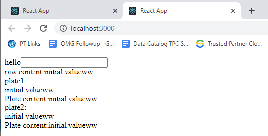

React app contains Plate editor created in the page, not referenced by productivitytools.plate package

It is a playground for me before moving code to the productivitytools.plate

Currently it allows to 
- set initial value
- change value (reset value)
- push events when field changes

